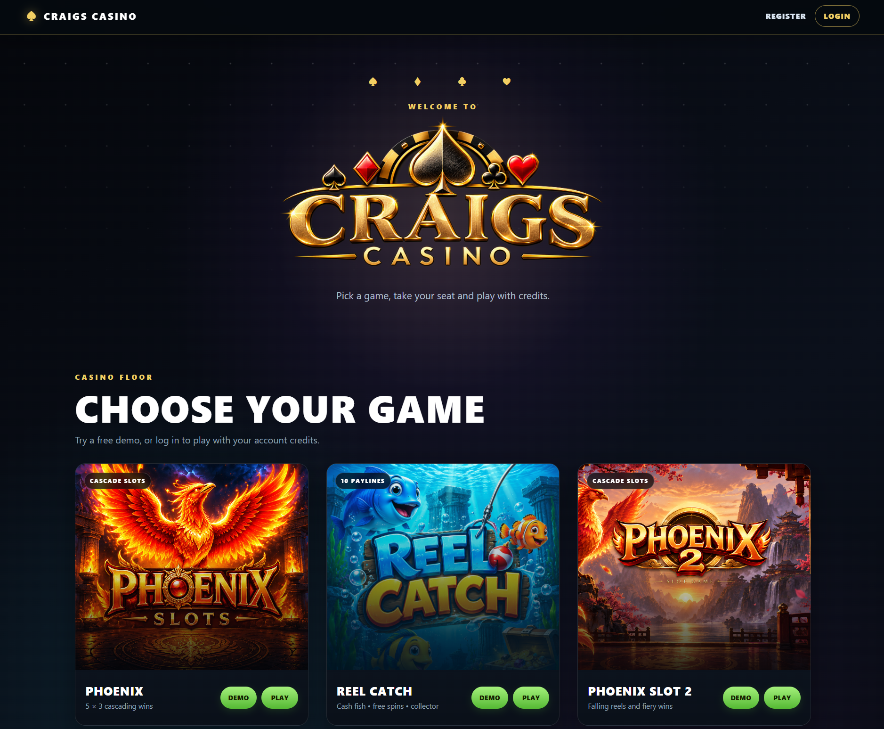
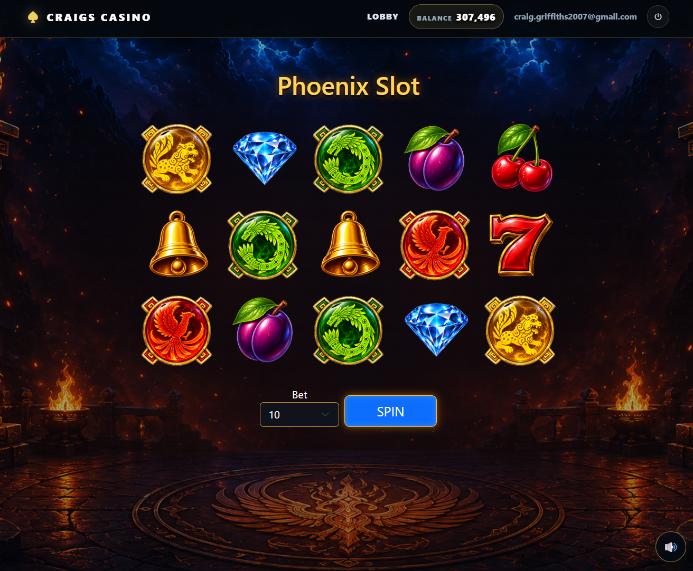
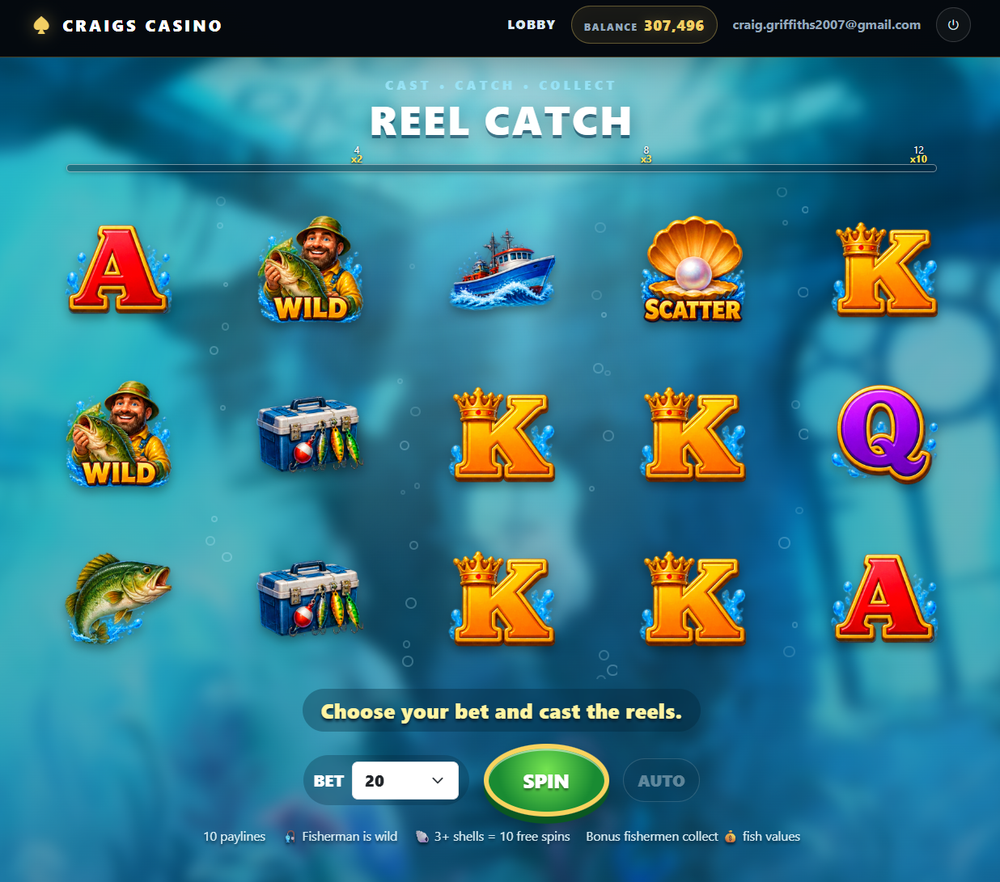

# 🎰 Craigs Casino

A work-in-progress ASP.NET Core casino hobby project, built for fun, learning and experimentation.

**Craigs Casino** is an open hobby project exploring how modern slot games work behind the scenes.

If you enjoy playing slot games and have ever wondered *"How did they make that happen?"*, this project is about finding out — by building the mechanics yourself.

There is **no real-money gambling**. Everything uses virtual credits and the project exists purely for development, education and entertainment.

## 🎮 Try it online

**Want to see it running?**

👉 **[Play Craigs Casino](https://craigscasino.runasp.net/)**

Create a free player account and try the games using virtual credits — no real money is involved.

## 🎮 Games

### 🔥 Phoenix Slots

A Phoenix-themed slot exploring falling reel animations, paylines, wild features, win effects, sound and other familiar slot-game mechanics.

### 🎣 Reel Catch

An underwater fishing-themed slot exploring reel animation, winning symbols, bonus features, bubbles, sound effects and atmospheric presentation.

## 💡 Why this project?

One of the most enjoyable things about building these games is discovering how much is happening behind what initially appears to be a simple slot machine.

Reel generation, paylines, symbol timing, animation, wilds, scatters, bonuses, credits, sound and visual feedback all have to work together.

If you enjoy the real games, it is incredibly satisfying to take one of those behaviours, work out how it operates and then see your own implementation working on screen.

The aim isn't to copy a particular commercial game. It's to understand the ideas and mechanics behind this type of game and create our own versions of them.

## 🤝 Get involved

**Anyone is welcome to contribute.**

This is deliberately a work-in-progress hobby project. You don't need to be a slot-game expert, and experiments are encouraged.

There are loads of interesting things you could have a go at:

- 🎰 Create another slot game
- 🎨 Design original symbols and artwork
- 🎁 Build a bonus round
- 🔥 Experiment with wild and scatter mechanics
- 🌀 Create different reel or cascade animations
- 🎵 Add original music and sound effects
- 💰 Experiment with paylines and payouts
- 🎮 Add free-spin features
- 📱 Improve mobile support
- 📊 Build game statistics or simulations
- 🐛 Find and fix bugs
- 💡 Suggest completely new features

If you've ever played a slot game and thought *"I'd like to know how that works"*, pick something and have a go.

Pull requests, ideas and experiments are welcome.

## 🛠️ Built with

- ASP.NET Core MVC
- C#
- Entity Framework Core
- ASP.NET Core Identity
- SQL Server
- Razor
- JavaScript
- HTML/CSS
- Browser audio and animation

## 🚧 Work in progress

Craigs Casino is actively being developed.

Things will change. Code will be refactored. Games will gain new features. Graphics and animations will evolve. And there will undoubtedly be bugs along the way.

That's part of the fun.

This isn't intended to be a production gambling platform — it's somewhere to experiment, learn and build something enjoyable.

## ⚠️ No real-money gambling

Craigs Casino is a **software-development, educational and hobby project**.

It does not accept deposits, offer withdrawals or award prizes. All credits used by the games are virtual and have **no monetary value**.

Commercial games, names, artwork and other intellectual property remain the property of their respective owners. This project develops original implementations inspired by general slot-game concepts and mechanics.

---

### 🎯 Build it. Break it. Improve it. Play it.

For developers who also enjoy slot games, there is something particularly satisfying about pressing **SPIN** and watching a game mechanic you wrote yourself come to life.

**That's what Craigs Casino is about. 🎰**
